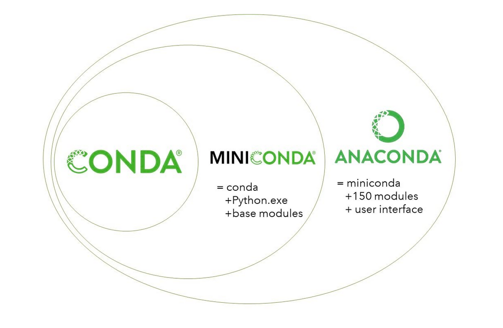

## Environments

Un *environment*, o entorno virtual, es una copia de Python que tiene como características estar aislada y operativa bajo un nombre específico. Este entorno matiene sus propios archivos, directorios y rutas de modo tal que se puede trabajar con específicas versiones de librerías de Python, o con el mismo Python, sin interferir sobre los demás proyectos. 

El principal uso de estos entornos se basa en la separación de distintos proyectos y evitar así problemas de compatibilidad y de dependencias de paquetes a lo largo del desarrollo de productos. 

El uso de estas herramientas no se evidencia a simple vista, y solo tiene sentido práctico si se tienen diferentes proyectos en la misma máquina. Por ejemplo, la ejecución de un script que hace uso de Python 2.8 puede dificultar a posteriori el uso de proyectos con Python 3.8, o ciertas librerías necesitan una versión específica para correr de la forma que están programadas debido a que cambian el nombre de funciones, o por obsolencia de ciertas características. 

Es aquí que los entornos virtuales nos dejan crear ambientes separados para cada proyecto, donde especificamos tanto la versión de Python como los de los paquetes a usar, sin que ello tenga repercusiones en los demás entornos creados o usados. 

Dentro de estos entornos, los más populares para Python son: 

1. Virtualenv
2. Conda
3. pipenv
4. venv

Conda es popular entre la comunidad científica y de datos, mientras que pipenv entre los ingenieros de software.

### El entorno conda y su uso dentro de la distribución Anaconda

Antes de entrar a los comando usados para manejar los entornos virtuales, hablaremos sobres ciertos términos y conceptos para dejar en claro las diferencias, por ejemplo, entre Conda, Miniconda y Anaconda. 

**Conda**  es una herramienta agnóstica, es decir que es independiente del lenguaje de programación utilizado, para el manejo de paquetes (Conda puede instalar, actualizar y eliminar paquetes ) y de entorno virtuales. 

**Anaconda** es la distribución de Python más popular para usuarios finales. Al instalar Anaconda, se obtiene Miniconda, Anaconda Navigator (una interfaz gráfica de usuario) y una selección de paquetes instalados. 

**Miniconda** es una versión reducida de Anaconda, que al mismo tiempo es una distribución de Python. Al instalar Miniconda, se obtiene Conda, Python and y un número más chico de paquetes instalados.

Como podemos ver en la imagen, Conda está incluido en ambos Anaconda y Miniconda.

https://uoa-eresearch.github.io/eresearch-cookbook/recipe/2014/11/20/conda/
https://towardsdatascience.com/introduction-to-conda-virtual-environments-eaea4ac84e28

### Creacion de un environment

With conda, you can create, export, list, remove, and update environments that have different versions of Python and/or packages installed in them. Switching or moving between environments is called activating the environment. You can also share an environment file.